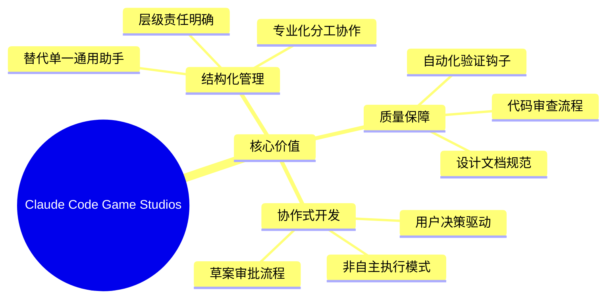
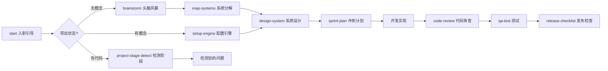
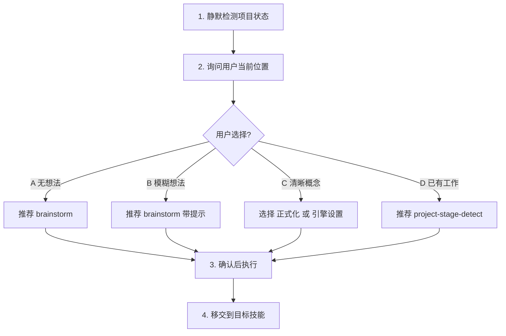
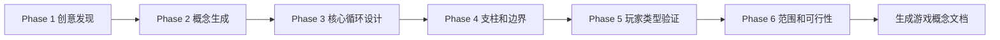
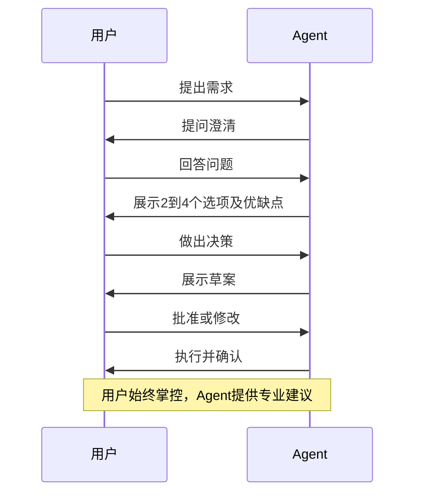

# Claude Code Game Studios - 项目分析报告

**分析日期**: 2026-03-25
**项目版本**: v0.3.0
**分析工具**: Claude Code

---

## 一、项目概述

### 1.1 项目简介

Claude Code Game Studios 是一个将单一 Claude Code 会话转变为完整游戏开发工作室的框架。它通过 48 个专业化代理、37 个工作流、8 个自动化钩子和 11 条编码规则，为 AI 辅助游戏开发提供了类似真实工作室的组织结构。

### 1.2 核心价值



### 1.3 类比理解

把这个项目想象成一个**虚拟游戏公司**:

- **你 (开发者)** = 游戏公司的 CEO/创意总监
- **Claude Code** = 公司的总办事处
- **48 个 Agent** = 48 个不同岗位的员工 (设计师、程序员、美术、音效、QA 等)
- **Skills** = 标准化的工作流程和操作手册
- **Hooks** = 自动化的质量检查系统
- **Rules** = 各部门的编码规范和最佳实践

你做所有决策，这个系统帮你组织、验证、执行。

---

## 二、项目结构分析

### 2.1 目录结构

```text
/
├── CLAUDE.md                    # 主配置文件
├── .claude/                     # Agent 定义、Skills、Hooks、Rules
│   ├── agents/                  # 48 个代理定义文件
│   ├── skills/                  # 37 个斜杠命令
│   ├── hooks/                   # 8 个自动化钩子脚本
│   ├── rules/                   # 11 条路径作用域编码规则
│   └── docs/                    # 文档和模板
│       └── templates/           # 29 个文档模板
├── docs/                        # 技术文档
│   └── engine-reference/        # 引擎 API 参考快照
├── production/                  # 生产管理
├── .github/                     # GitHub 配置
├── README.md                    # 项目说明
├── UPGRADING.md                 # 升级指南
└── LICENSE                      # MIT 许可证
```

### 2.2 资源统计

| 类别 | 数量 | 说明 |
|------|------|------|
| **Agents** | 48 | 覆盖设计、编程、美术、音频、叙事、QA、生产等领域的专业化代理 |
| **Skills** | 37 | 斜杠命令工作流，如 start、sprint-plan、code-review 等 |
| **Hooks** | 8 | 自动化验证脚本，在提交、推送、资源变更时触发 |
| **Rules** | 11 | 基于路径的编码标准，针对不同代码区域自动执行 |
| **Templates** | 29 | 文档模板，包括 GDD、ADR、冲刺计划、经济模型等 |

---

## 三、代理体系架构 (Agents)

### 3.1 三层级级结构

```mermaid
flowchart TD
    subgraph Tier1 [Tier 1 - 总监层 Opus]
        CD[creative-director 创意总监]
        TD[technical-director 技术总监]
        PR[producer 制作人]
    end

    subgraph Tier2 [Tier 2 - 部门主管层 Sonnet]
        GD[game-designer 游戏设计师]
        LP[lead-programmer 首席程序员]
        AD[art-director 美术总监]
        AUD[audio-director 音频总监]
        ND[narrative-director 叙事总监]
        QL[qa-lead QA主管]
        RM[release-manager 发布经理]
        LL[localization-lead 本地化主管]
    end

    subgraph Tier3 [Tier 3 - 专家层 Sonnet/Haiku]
        GP[gameplay-programmer 玩法程序员]
        EP[engine-programmer 引擎程序员]
        AI[ai-programmer AI程序员]
        NP[network-programmer 网络程序员]
        TP[tools-programmer 工具程序员]
        UP[ui-programmer UI程序员]
        SD[sound-designer 音效设计师]
        WR[writer 编剧]
        WB[world-builder 世界构建师]
        UX[ux-designer UX设计师]
        TA[technical-artist 技术美术]
        QT[qa-tester QA测试员]
        PA[performance-analyst 性能分析师]
        DO[devops-engineer DevOps工程师]
        AN[analytics-engineer 数据分析师]
        SE[security-engineer 安全工程师]
        AC[accessibility-specialist 无障碍专家]
        LO[live-ops-designer 长线运营设计师]
        CM[community-manager 社区经理]
        PT[prototyper 原型师]
        SY[systems-designer 系统设计师]
        LV[level-designer 关卡设计师]
        EC[economy-designer 经济设计师]
    end

    CD --> GD
    CD --> AD
    CD --> AUD
    CD --> ND
    TD --> LP
    PR --> QL
    PR --> RM
    PR --> LL

    GD --> SY
    GD --> LV
    GD --> EC
    LP --> GP
    LP --> EP
    LP --> AI
    LP --> NP
    LP --> TP
    LP --> UP
    AD --> TA
    AD --> UX
    AUD --> SD
    ND --> WR
    ND --> WB
    QL --> QT
```



### 3.2 引擎专家体系

项目支持三大主流游戏引擎，每种引擎配置了专属的专家代理:

| 引擎 | 主管代理 | 子专家 |
|------|----------|--------|
| **Godot 4** | godot-specialist | GDScript专家、着色器专家、GDExtension专家 |
| **Unity** | unity-specialist | DOTS/ECS专家、着色器/VFX专家、Addressables专家、UI专家 |
| **Unreal Engine 5** | unreal-specialist | GAS专家、蓝图专家、网络复制专家、UMG专家 |

### 3.3 核心代理详解

#### 3.3.1 创意总监 (creative-director)

**模型**: Opus
**职责**: 项目最高创意权威

**核心职能**:
| 职能 | 描述 |
|------|------|
| 愿景守护 | 维护和传达游戏核心支柱、幻想和目标体验 |
| 支柱冲突解决 | 当设计、叙事、美术、音频目标冲突时进行裁决 |
| 基调和感觉 | 定义并执行游戏的情感基调、审美感受和体验目标 |
| 竞争定位 | 理解类型格局，确保游戏有清晰的差异化身份 |
| 范围仲裁 | 当创意野心超出产能时，决定删减什么、简化什么、保护什么 |
| 参考策展 | 维护游戏、电影、音乐、艺术参考库 |

**决策框架**:
1. 这是否服务于核心幻想?
2. 这是否尊重已确立的支柱?
3. 这是否服务于目标 MDA 美学?
4. 这是否与现有决策形成连贯体验?
5. 这是否增强竞争定位?
6. 这是否在约束范围内可实现?

**委托关系**:
- 委托给: game-designer, art-director, audio-director, narrative-director
- 上报目标: 无 (最高创意层)

#### 3.3.2 游戏设计师 (game-designer)

**模型**: Sonnet
**职责**: 游戏机制和系统设计

**核心职能**:
| 职能 | 描述 |
|------|------|
| 核心循环设计 | 定义即时、会话、长期玩法循环，使用嵌套循环模型 |
| 系统设计 | 设计互锁的游戏系统（战斗、制作、进度、经济）|
| 平衡框架 | 建立平衡方法论 —— 数学模型、参考曲线、调优旋钮 |
| 玩家体验映射 | 使用 MDA 框架定义预期的玩家情感弧线 |
| 边界情况文档 | 记录每个机制的边界情况和退化策略 |
| 设计文档 | 维护 design/gdd/ 中的综合设计文档 |

**理论框架**:
- **MDA 框架**: 从玩家情感体验向后设计（美学 → 动态 → 机制）
- **自我决定理论**: 自主性、能力感、关联性
- **心流状态设计**: 挑战-技能平衡，锯齿形难度曲线
- **Bartle 玩家类型**: 成就者、探索者、社交者、竞争者

**设计文档标准**（8个必需章节）:
1. 概述
2. 玩家幻想
3. 详细规则
4. 公式
5. 边界情况
6. 依赖关系
7. 调优旋钮
8. 验收标准

**委托关系**:
- 委托给: systems-designer, level-designer, economy-designer
- 上报给: creative-director

### 3.4 完整代理清单

#### Tier 1 - 总监层

| 代理 | 模型 | 领域 | 使用场景 |
|------|------|------|----------|
| creative-director | Opus | 创意愿景 | 重大创意决策、支柱冲突、基调方向 |
| technical-director | Opus | 技术愿景 | 架构决策、技术栈选择、性能策略 |
| producer | Opus | 生产管理 | 冲刺计划、里程碑跟踪、风险管理、协调 |

#### Tier 2 - 部门主管层

| 代理 | 模型 | 领域 | 使用场景 |
|------|------|------|----------|
| game-designer | Sonnet | 游戏设计 | 机制、系统、进度、经济、平衡 |
| lead-programmer | Sonnet | 代码架构 | 系统设计、代码审查、API设计、重构 |
| art-director | Sonnet | 视觉方向 | 风格指南、美术圣经、资源标准、UI/UX方向 |
| audio-director | Sonnet | 音频方向 | 音乐方向、声音调色板、音频实现策略 |
| narrative-director | Sonnet | 故事和写作 | 故事弧线、世界构建、角色设计、对话策略 |
| qa-lead | Sonnet | 质量保证 | 测试策略、Bug分类、发布准备、回归计划 |
| release-manager | Sonnet | 发布流水线 | 构建管理、版本控制、变更日志、部署 |
| localization-lead | Sonnet | 国际化 | 字符串外化、翻译流水线、区域测试 |

#### Tier 3 - 专家层

| 代理 | 模型 | 领域 | 使用场景 |
|------|------|------|----------|
| systems-designer | Sonnet | 系统设计 | 特定机制实现、公式设计、循环 |
| level-designer | Sonnet | 关卡设计 | 关卡布局、节奏、遭遇设计、流程 |
| economy-designer | Sonnet | 经济/平衡 | 资源经济、战利品表、进度曲线 |
| gameplay-programmer | Sonnet | 玩法代码 | 功能实现、玩法系统代码 |
| engine-programmer | Sonnet | 引擎系统 | 核心引擎、渲染、物理、内存管理 |
| ai-programmer | Sonnet | AI系统 | 行为树、寻路、NPC逻辑、状态机 |
| network-programmer | Sonnet | 网络 | 网络代码、复制、延迟补偿、匹配 |
| tools-programmer | Sonnet | 开发工具 | 编辑器扩展、流水线工具、调试工具 |
| ui-programmer | Sonnet | UI实现 | UI框架、屏幕、控件、数据绑定 |
| technical-artist | Sonnet | 技术美术 | 着色器、VFX、优化、美术流水线工具 |
| sound-designer | Haiku | 音效设计 | SFX设计文档、音频事件列表、混音笔记 |
| writer | Sonnet | 对话/传说 | 对话写作、传说条目、物品描述 |
| world-builder | Sonnet | 世界/传说设计 | 世界规则、阵营设计、历史、地理 |
| qa-tester | Haiku | 测试执行 | 编写测试用例、Bug报告、测试检查表 |
| performance-analyst | Sonnet | 性能 | 性能分析、优化建议、内存分析 |
| devops-engineer | Haiku | 构建/部署 | CI/CD、构建脚本、版本控制工作流 |
| analytics-engineer | Sonnet | 遥测 | 事件跟踪、仪表板、A/B测试设计 |
| ux-designer | Sonnet | UX流程 | 用户流程、线框图、无障碍、输入处理 |
| prototyper | Sonnet | 快速原型 | 一次性原型、机制测试、可行性验证 |
| security-engineer | Sonnet | 安全 | 反作弊、漏洞防护、存档加密、网络安全 |
| accessibility-specialist | Haiku | 无障碍 | WCAG合规、色盲模式、重映射、文字缩放 |
| live-ops-designer | Sonnet | 长线运营 | 赛季、活动、战斗通行证、留存、经济 |
| community-manager | Haiku | 社区 | 补丁说明、玩家反馈、危机沟通、社区健康 |

---

## 四、工作流系统 (Skills)

### 4.1 命令分类

| 分类 | 命令 | 用途 |
|------|------|------|
| **项目初始化** | start, setup-engine, project-stage-detect | 引导式入职、引擎配置、项目阶段检测 |
| **创意设计** | brainstorm, design-system, map-systems | 游戏概念构思、系统设计、系统分解 |
| **审查分析** | design-review, code-review, balance-check, asset-audit | 设计文档审查、代码审查、平衡性检查、资源审计 |
| **生产管理** | sprint-plan, milestone-review, estimate, retrospective | 冲刺计划、里程碑评审、工作量估算、回顾总结 |
| **发布流程** | release-checklist, launch-checklist, changelog, patch-notes | 发布检查、上线检查、变更日志、补丁说明 |
| **团队编排** | team-combat, team-narrative, team-ui, team-release 等 | 多代理协作完成复杂功能 |
| **其他工具** | bug-report, prototype, localize, perf-profile 等 | Bug报告、原型开发、本地化、性能分析 |

### 4.2 典型工作流程



### 4.3 核心技能详解

#### 4.3.1 入职引导 (start)

**触发**: 用户输入 start 命令
**目的**: 首次入职 —— 询问用户当前状态，引导到正确的工作流

**工作流程**:



**项目状态检测**:
- 引擎是否配置?
- 游戏概念是否存在?
- 源代码是否存在?
- 原型是否存在?
- 设计文档是否存在?
- 生产工件是否存在?

**四条路径**:
| 路径 | 用户状态 | 推荐操作 |
|------|----------|----------|
| A | 无想法 | 运行 brainstorm open |
| B | 模糊想法 | 运行 brainstorm [hint] |
| C | 清晰概念 | 选择正式化或直接引擎设置 |
| D | 已有工作 | 运行 project-stage-detect |

#### 4.3.2 头脑风暴 (brainstorm)

**触发**: 用户输入 brainstorm 命令
**目的**: 引导式游戏概念构思 —— 从零想法到结构化游戏概念文档

**六个阶段**:



**Phase 1: 创意发现**
- 情感锚点: 什么游戏时刻让你感动、兴奋、忘我?
- 品味画像: 你花时间最多的3款游戏是什么?
- 实际约束: 独立开发者还是团队? 时间线? 平台?
- 输出: 创意简报 (3-5句话)

**Phase 2: 概念生成**
- 技术1: 动词优先设计 (build, fight, explore, solve...)
- 技术2: 混搭方法 ([类型A] + [主题B])
- 技术3: 体验优先设计 (MDA向后)
- 输出: 3个不同方向的完整概念

**Phase 3: 核心循环设计**
- 30秒循环 (即时): 玩家最常做的物理动作
- 5分钟循环 (短期目标): "再来一局"心理
- 会话循环 (30-120分钟): 完整会话结构
- 进度循环 (天/周): 玩家如何成长

**Phase 4: 支柱和边界**
- 3-5个支柱: 每个有名称、定义、设计测试
- 3+反支柱: 这款游戏**不是**什么

**Phase 5: 玩家类型验证**
- 使用 Bartle 分类和 Quantic Foundry 模型
- 主要玩家类型、次要吸引力、不适合人群

**Phase 6: 范围和可行性**
- 引擎推荐
- 美术流水线
- 内容范围估算
- MVP 定义
- 最大风险

**输出文件**: `design/gdd/game-concept.md`

#### 4.3.3 团队编排技能

团队编排技能协调多个代理在单一功能上工作:

| 技能 | 协调的代理 | 用途 |
|------|-----------|------|
| team-combat | game-designer + gameplay-programmer + ai-programmer + technical-artist + sound-designer + qa-tester | 战斗系统开发 |
| team-narrative | narrative-director + writer + world-builder + level-designer | 叙事内容创建 |
| team-ui | ux-designer + ui-programmer + art-director | UI系统开发 |
| team-release | release-manager + qa-lead + devops-engineer + producer | 发布流程执行 |
| team-polish | performance-analyst + technical-artist + sound-designer + qa-tester | 打磨优化 |
| team-audio | audio-director + sound-designer + technical-artist + gameplay-programmer | 音频流水线 |
| team-level | level-designer + narrative-director + world-builder + art-director + systems-designer + qa-tester | 关卡设计 |

### 4.4 完整技能清单

| 命令 | 目的 | 分类 |
|------|------|------|
| start | 首次入职 —— 询问位置，引导到正确工作流 | 项目管理 |
| setup-engine | 配置引擎+版本，检测知识差距，填充版本感知参考文档 | 项目管理 |
| project-stage-detect | 自动分析项目状态、检测阶段、识别差距、推荐下一步 | 项目管理 |
| reverse-document | 从现有实现生成设计或架构文档 | 项目管理 |
| gate-check | 验证开发阶段间推进的准备度 | 项目管理 |
| map-systems | 将游戏概念分解为系统、映射依赖、确定设计顺序 | 项目管理 |
| design-system | 引导式、逐章节的单一游戏系统 GDD 编写 | 项目管理 |
| brainstorm | 使用专业工作室方法引导概念构思 | 创意 |
| design-review | 审查游戏设计文档的完整性和一致性 | 审查 |
| code-review | 文件或变更集的架构代码审查 | 审查 |
| balance-check | 分析游戏平衡数据并标记异常 | 审查 |
| asset-audit | 审计资源命名、大小和流水线合规性 | 审查 |
| scope-check | 分析功能或冲刺范围与原计划的对比 | 审查 |
| perf-profile | 结构化性能分析，识别瓶颈 | 审查 |
| tech-debt | 扫描、跟踪、优先级排序技术债务 | 审查 |
| sprint-plan | 生成或更新冲刺计划 | 生产 |
| milestone-review | 评审里程碑进度并生成状态报告 | 生产 |
| estimate | 生成结构化工作量估算 | 生产 |
| retrospective | 运行结构化冲刺或里程碑回顾 | 生产 |
| bug-report | 创建结构化 Bug 报告 | 生产 |
| release-checklist | 生成并验证当前构建的发布前检查表 | 发布 |
| launch-checklist | 跨所有部门的完整上线准备验证 | 发布 |
| changelog | 从 git 提交和冲刺数据自动生成变更日志 | 发布 |
| patch-notes | 从 git 历史生成面向玩家的补丁说明 | 发布 |
| hotfix | 紧急修复工作流，绕过正常冲刺流程 | 发布 |
| prototype | 搭建一次性原型测试机制或技术方法 | 创意 |
| playtest-report | 生成结构化游玩测试报告模板 | 创意 |
| onboard | 为新贡献者或代理生成入职上下文 | 创意 |
| localize | 本地化工作流：扫描硬编码字符串、提取、验证翻译 | 创意 |

---

## 五、自动化系统

### 5.1 Hooks (钩子系统)

| 钩子 | 触发时机 | 功能 |
|------|----------|------|
| session-start.sh | 会话开启 | 加载冲刺上下文、最近Git活动 |
| detect-gaps.sh | 会话开启 | 检测新项目、缺失文档 |
| validate-commit.sh | Git提交 | 检查硬编码值、TODO格式、JSON有效性 |
| validate-push.sh | Git推送 | 警告受保护分支推送 |
| validate-assets.sh | 资源写入 | 验证命名规范和JSON结构 |
| pre-compact.sh | 上下文压缩 | 保存会话进度笔记 |
| session-stop.sh | 会话关闭 | 记录完成事项 |
| log-agent.sh | Agent启动 | 子代理调用审计跟踪 |

### 5.2 Rules (规则系统)

基于路径的编码标准，自动应用于特定目录:

| 规则文件 | 作用路径 | 强制内容 |
|----------|----------|----------|
| gameplay-code.md | src/gameplay/** | 数据驱动、delta time、无UI引用 |
| engine-code.md | src/core/** | 热路径零分配、线程安全、API稳定性 |
| ai-code.md | src/ai/** | 性能预算、可调试性、数据驱动参数 |
| network-code.md | src/networking/** | 服务器权威、版本化消息、安全性 |
| ui-code.md | src/ui/** | 无游戏状态所有权、本地化就绪、无障碍 |
| design-docs.md | design/gdd/** | 必需8个章节、公式格式、边界情况 |
| test-standards.md | tests/** | 测试命名、覆盖率要求、测试夹具模式 |
| prototype-code.md | prototypes/** | 放宽标准、必需README、假设文档化 |

---

## 六、设计哲学

### 6.1 理论基础

项目基于专业游戏开发实践:

- **MDA 框架** — 机制(Mechanics)、动态(Dynamics)、美学(Aesthetics) 分析法
- **自我决定理论** — 自主性、能力感、关联性 驱动玩家动机
- **心流状态设计** — 挑战-技能平衡促进玩家投入
- **Bartle 玩家类型** — 受众定位和验证
- **验证驱动开发** — 先写测试，再实现

### 6.2 协作协议



---

## 七、技术特性

### 7.1 跨平台支持

- 在 Windows 10 + Git Bash 环境测试
- 所有钩子使用 POSIX 兼容模式 (grep -E 而非 grep -P)
- 包含缺失工具的降级方案
- 原生支持 macOS 和 Linux

### 7.2 可定制性

这是一个**模板**，而非锁定框架:

- 添加/删除 Agent
- 编辑 Agent 提示词
- 修改 Skills 工作流
- 添加路径规则
- 调整钩子验证严格度
- 选择使用的引擎专家集

---

## 八、版本历史

| 版本 | 主要更新 |
|------|----------|
| **v0.3.0** | design-system, map-systems, 状态行, 升级指南 |
| **v0.2.0** | 上下文韧性, AskUserQuestion, design-systems |
| **v0.1.0** | 游戏工作室代理架构完整搭建 (Phase 1-7) |

---

## 九、推荐使用场景

### 适合

- 独立游戏开发者想要结构化的 AI 辅助
- 小型团队需要虚拟专家支持
- 学习专业游戏开发流程
- 管理复杂游戏项目

### 不适合

- 只需要简单代码补全的场景
- 完全自主的 AI 开发 (这不是自动飞行系统)
- 非游戏类项目

---

## 十、快速上手

1. **克隆仓库**
   ```bash
   git clone https://github.com/Donchitos/Claude-Code-Game-Studios.git my-game
   cd my-game
   ```

2. **启动 Claude Code**
   ```bash
   claude
   ```

3. **运行入职引导**
   ```
   /start
   ```

4. **根据引导选择你的状态**
   - 无想法 → 使用 /brainstorm
   - 有概念 → 使用 /setup-engine 配置引擎
   - 有代码 → 使用 /project-stage-detect 分析项目

---

## 引用参考

- [Claude Code 官方文档](https://docs.anthropic.com/en/docs/claude-code)
- [GitHub 仓库](https://github.com/Donchitos/Claude-Code-Game-Studios)
- [Godot 官方文档](https://docs.godotengine.org/en/stable/)
- [Unity 官方文档](https://docs.unity3d.com/)
- [Unreal Engine 官方文档](https://docs.unrealengine.com/)
- [MDA 框架论文](https://www.researchgate.net/publication/228884866_MDA_A_Formal_Approach_to_Game_Design_and_Game_Research)
- [自我决定理论](https://selfdeterminationtheory.org/)
- [Bartle 玩家类型](https://mud.co.uk/richard/hcds.htm)

---

*本报告由 Claude Code 自动生成*
